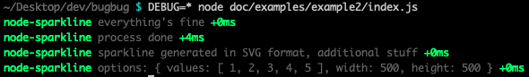
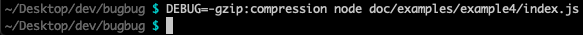
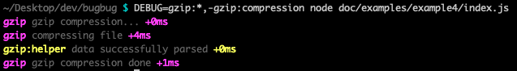

<p align="center">
  
<p>

<p align="center">
  A lightweight, zero-dependencies, asynchronous and <strong>fully-tested</strong> pure Node.js debugger.
<p>

# Table of Contents
- [Presentation](#presentation)
- [Installation](#installation)
- [Technical information](#technical-information)
  - [Node.js](#nodejs)
  - [Tests](#tests)
    - [Linting](#linting)
    - [Unit](#unit)
- [Usage](#usage)
  - [Library](#library)
    - [Import bugbug](#import-bugbug)
    - [getDebugger(name, color)](#getdebuggername-color)
    - [Examples](#examples)
  - [Environment variable](#environment-variable)
    - [Examples](#examples-1)
- [Development](#development)
- [Licence](#licence)

# Presentation

*bugbug* is a lightweight, zero-dependencies, asynchronous and **fully-tested** pure Node.js debugger. It writes on *process.stderr* when the *DEBUG* environment variable is set and match a specific module's name/pattern and uses a specified/random output color if the terminal allows it.

The aim of this project is to provide a very simple, lightweight, zero-dependency, fast and **fully-tested** debugger.

# Installation

`npm install bugbug`

`npm i -S bugbug`

# Technical information

## Node.js

- Language: JavaScript ES6/ES7
- VM: Node.js >=10.0.0

## Tests

Command to run all tests:

`npm test`

### Linting

ESLint with Airbnb base rules. See [Airbnb JavaScript Style Guide](https://github.com/airbnb/javascript).

`npm run test:lint`

### Unit

Mocha and Chai.

`npm run test:unit`

# Usage

## Library

### Import bugbug

*bugbug* module exports one function named *getDebugger*. This function once called will return the debug function related to a specific debugger's name that will allow to debug on *stderr*.

```javascript
// first get the getDebugger function
const getDebugger = require('bugbug');

// then get the debug function from a stored or newly created debugger
const debug = getDebugger('my-module', 'red');

// OR faster way to get the debug function
const debug = require('bugbug')('my-module', 'red');
```

### getDebugger(name, color)

  - `name` **<String\>** The debugger's name. Generally the module's name to debug. *Default*: `debug`
  - `color` **<String\>** The debugging color if the terminal allows it. *Default*: `red` for the default debugger or a `random` color
    - `red`
    - `green`
    - `yellow`
    - `blue`
    - `magenta`
    - `cyan`
    - `lightRed`
    - `lightGreen`
    - `lightYellow`
    - `lightBlue`
    - `lightMagenta`
    - `lightCyan`


  - Returns: **<Function\>** Function called *debug* to finally debug in the name of the related module.
  - Throws: **NO**

### Examples

You can find examples here: [doc/examples](doc/examples)

#### Example 1
```javascript
const debug = require('bugbug')('my-module', 'red');

debug('debugging');
debug('still debugging');
```


#### Example 2
```javascript
const debug = require('bugbug')('node-sparkline', 'green');

const options = {
  values: [1, 2, 3, 4, 5],
  width: 500,
  height: 500,
};

debug('everything\'s fine');
debug('process done');
debug('sparkline generated in SVG format,', 'additional stuff');
debug('options:', options);
```



#### Example 3
```javascript
const debug = require('bugbug')();

const options = {
  values: [1, 2, 3, 4, 5],
  width: 500,
  height: 500,
};

debug('main debugger is debugging');
debug('in red color if terminal allows it');
debug('options:', options);
```


## Environment variable

**DEBUG** is used to whether debug a specific module. *DEBUG* value can be a **comma-separated string** listing module names to debug or to avoid debugging. Format is: `DEBUG=moduleName[,moduleName]`
  - `DEBUG=moduleName` will debug *moduleName* module;
  - `DEBUG=moduleName:*` will debug *moduleName* module and sub modules;
  - `DEBUG=-moduleName:*` will disable debugging any *moduleName* module and sub modules;
  - `DEBUG=*` will debug all *moduleName* module and sub modules plus other modules used in your project if they use **bugbug** or an equivalent debugger based on *process.env.DEBUG* value.

### Examples

#### DEBUG=*


#### DEBUG=gzip


#### DEBUG=gzip:compression


#### DEBUG=-gzip:compression


#### DEBUG=gzip:*,-gzip:compression


#### DEBUG=*,-gzip:compression


#### DEBUG=\*,-gzip:*


# Development

All contributions are greatly welcome :)

Please follow Git flow, ES6/7, ESLint Airbnb base rules.

# Licence

*bugbug* is released under the MIT license.

Copyright (C) 2020 Adrien Valcke

Permission is hereby granted, free of charge, to any person obtaining a copy of this software and associated documentation files (the "Software"), to deal in the Software without restriction, including without limitation the rights to use, copy, modify, merge, publish, distribute, sublicense, and/or sell copies of the Software, and to permit persons to whom the Software is furnished to do so, subject to the following conditions:

The above copyright notice and this permission notice shall be included in all copies or substantial portions of the Software.

THE SOFTWARE IS PROVIDED "AS IS", WITHOUT WARRANTY OF ANY KIND, EXPRESS OR IMPLIED, INCLUDING BUT NOT LIMITED TO THE WARRANTIES OF MERCHANTABILITY, FITNESS FOR A PARTICULAR PURPOSE AND NON INFRINGEMENT. IN NO EVENT SHALL THE AUTHORS OR COPYRIGHT HOLDERS BE LIABLE FOR ANY CLAIM, DAMAGES OR OTHER LIABILITY, WHETHER IN AN ACTION OF CONTRACT, TORT OR OTHERWISE, ARISING FROM, OUT OF OR IN CONNECTION WITH THE SOFTWARE OR THE USE OR OTHER DEALINGS IN THE SOFTWARE.
