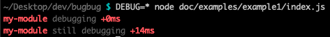
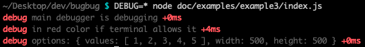
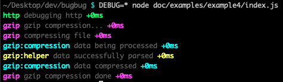
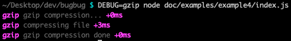
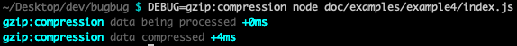
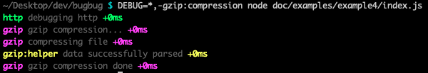

<p align="center">
  
<p>

<p align="center">
  A lightweight, zero-dependencies, asynchronous and <strong>fully-tested</strong> pure Node.js debugger.
<p>

# Table of Contents
- [Presentation](#presentation)
- [Installation](#installation)
- [Technical information](#technical-information)
  - [Node.js](#nodejs)
  - [Tests](#tests)
    - [Linting](#linting)
    - [Unit](#unit)
- [Usage](#usage)
  - [Library](#library)
    - [Import bugbug](#import-bugbug)
    - [getDebugger(name, color)](#getdebuggername-color)
    - [Examples](#examples)
  - [Environment variable](#environment-variable)
    - [Examples](#examples-1)
- [Code of Conduct](#code-of-conduct)
- [Contributing](#contributing)
- [Support](#support)
- [Security](#security)
- [License](#license)

# Presentation

*bugbug* is a lightweight, zero-dependencies, asynchronous and **fully-tested** pure Node.js debugger. It writes on *process.stderr* when the *DEBUG* environment variable is set and match a specific module's name/pattern and uses a specified/random output color if the terminal allows it.

The aim of this project is to provide a very simple, lightweight, zero-dependency, fast and **fully-tested** debugger.

# Installation

`npm install bugbug`

`npm i -S bugbug`

# Technical information

## Node.js

- Language: JavaScript ES6/ES7
- VM: Node.js >=10.0.0

## Tests

Command to run all tests:

`npm test`

### Linting

ESLint with Airbnb base rules. See [Airbnb JavaScript Style Guide](https://github.com/airbnb/javascript).

`npm run test:lint`

### Unit

Mocha and Chai.

`npm run test:unit`

# Usage

## Library

### Import bugbug

*bugbug* module exports one function named *getDebugger*. This function once called will return the debug function related to a specific debugger's name that will allow to debug on *stderr*.

```javascript
// first get the getDebugger function
const getDebugger = require('bugbug');

// then get the debug function from a stored or newly created debugger
const debug = getDebugger('my-module', 'red');

// OR faster way to get the debug function
const debug = require('bugbug')('my-module', 'red');
```

### getDebugger(name, color)

  - `name` **<String\>** The debugger's name. Generally the module's name to debug. *Default*: `debug`
  - `color` **<String\>** The debugging color if the terminal allows it. *Default*: `red` for the default debugger or a `random` color
    - `red`
    - `green`
    - `yellow`
    - `blue`
    - `magenta`
    - `cyan`
    - `lightRed`
    - `lightGreen`
    - `lightYellow`
    - `lightBlue`
    - `lightMagenta`
    - `lightCyan`


  - Returns: **<Function\>** Function called *debug* to finally debug in the name of the related module.
  - Throws: **NO**

### Examples

You can find examples here: [docs/examples](docs/examples)

#### Example 1
```javascript
const debug = require('bugbug')('my-module', 'red');

debug('debugging');
debug('still debugging');
```



#### Example 2
```javascript
const debug = require('bugbug')('node-sparkline', 'green');

const options = {
  values: [1, 2, 3, 4, 5],
  width: 500,
  height: 500,
};

debug('everything\'s fine');
debug('process done');
debug('sparkline generated in SVG format,', 'additional stuff');
debug('options:', options);
```


#### Example 3
```javascript
const debug = require('bugbug')();

const options = {
  values: [1, 2, 3, 4, 5],
  width: 500,
  height: 500,
};

debug('main debugger is debugging');
debug('in red color if terminal allows it');
debug('options:', options);
```



## Environment variable

**DEBUG** is used to whether debug a specific module. *DEBUG* value can be a **comma-separated string** listing module names to debug or to avoid debugging. Format is: `DEBUG=moduleName[,moduleName]`
  - `DEBUG=moduleName` will debug *moduleName* module;
  - `DEBUG=moduleName:*` will debug *moduleName* module and sub modules;
  - `DEBUG=-moduleName:*` will disable debugging any *moduleName* module and sub modules;
  - `DEBUG=*` will debug all *moduleName* module and sub modules plus other modules used in your project if they use **bugbug** or an equivalent debugger based on *process.env.DEBUG* value.

### Examples

#### DEBUG=*


#### DEBUG=gzip


#### DEBUG=gzip:compression


#### DEBUG=-gzip:compression


#### DEBUG=gzip:*,-gzip:compression


#### DEBUG=*,-gzip:compression


#### DEBUG=\*,-gzip:*


# Code of Conduct
This project has a [Code of Conduct](.github/CODE_OF_CONDUCT.md). By interacting with this repository, organization, or community you agree to abide by its terms.

# Contributing
Please take a moment to read our [Contributing Guidelines](.github/CONTRIBUTING.md) if you haven't yet done so.

# Support
Please see our [Support](.github/SUPPORT.md) page if you have any questions or for any help needed.

# Security
For any security concerns or issues, please visit our [Security Policy](.github/SECURITY.md) page.

# License
[MIT](LICENSE.md).
